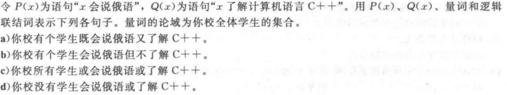

***

# 1-1

**3.** 

 

答：
a) Steve 的笔记本电脑没有大于100GB的空闲磁盘空间。
b) Zach没有阻止来自Jennifer的邮件或者他没有阻止来自Jennifer的短信。
c) 7$\times$11$\times$13 != 999 。
d) Diane没有在周日骑了100英里自行车。

**5.** 

p:"在新泽西海岸游泳是允许的"；q："在海岸附近发现过鲨鱼"
答：
a) $\neg$ q :“在海岸附近没有发现过鲨鱼”
b) p $\wedge$ q :“在新泽西海岸游泳是允许的，并且在海岸附近发现过鲨鱼“
c) $\neg$ p $\vee$ q :在新泽西海岸游泳是不允许的，或者在海岸附近发现过鲨鱼
d) p $\rightarrow$ $\neg$ q :如果在新泽西海岸游泳是允许的，那么在海岸附近没有发现过鲨鱼
e) $\neg$ q $\rightarrow$ p :如果在海岸附近没有发现过鲨鱼，那么在新泽西海岸游泳是允许的
f) $\neg$ p $\rightarrow$ $\neg$ q :如果在新泽西海岸游泳是不允许的，那么在海岸附近没有发现过鲨鱼
g) p $\leftrightarrow$ $\neg$ q : 在新泽西海岸游泳是允许的当且仅当在海岸附近没有发现过鲨鱼
h)$\neg$ p $\wedge$ (p $\vee$ $\neg$ q) :在新泽西海岸游泳是不允许的，并且或者在新泽西海岸游泳是允许的或者在海岸附近没有发现过鲨鱼

**7.** 

 

解：
a) $\neg$ p
b) p $\wedge$ $\neg$ q
c) p $\rightarrow$ q
d) $\neg$ p $\rightarrow$ $\neg$ q
e) p $\rightarrow$ q
f) $\neg$ p $\wedge$ q
g) q $\rightarrow$ p

**8.**

解：

a）r $\wedge$ $\neg$ p
b) $\neg$ p $\wedge$ q$\wedge$ r
c) r $\rightarrow$ (q $\leftrightarrow$ $\neg$ p)
d) $\neg$ q $\wedge$ $\neg$ p $\wedge$ r
e) (q $\rightarrow$  ($\neg$ r $\wedge$ $\neg$ p) ) $\wedge$  $\neg$ ( ($\neg$ r $\wedge$ $\neg$ p)  $\rightarrow$  q)
f) (p $\wedge$ r) $\rightarrow$  $\neg$ q

**12.** 

 

 

解：

a) 如果吹东北风，那么就会下雪。
b）如果天暖持续一周，那么苹果树会开花。
c）如果活塞队赢得了冠军，那么他们打败了湖人队。
d）如果要到达朗玛峰的顶峰，那么必须走8英里。
e）如果能闻名世界，那么就能得到终身教授职位。
f）如果你驾车超过400英里，那么你就需要买 汽油了。
g）如果你的保修单是有效的，那么你购买的CD机不超过90天。
h）如果水不太凉，那么Jan就要去游泳。

**19.** 

 

 

真值表：

|| p | q | r | p $\rightarrow$ ($\neg$ q $\vee$ r) | $\neg$ p $\rightarrow$ (q $\rightarrow$ r) | (p $\rightarrow$ q) $\vee$  ($\neg$ p $\rightarrow$ r) |
|:--:| :--: | :--: | :--: | :--: | :--: | :--: |
|1| T | T | T | T | T | T |
|2|T | T | F | F | T | T |
|3| T | F | T | T | T | T |
|4| F |  T   | T    | T | T | T |
|5|  T   |  F   | F    | T | T | T |
|6|  F   |  T   | F    | T | F | T |
|7| F | F | T | T | T | T |
|8| F | F | F | T | T | T |

(续)

|| (p $\rightarrow$ q) $\wedge$ ($\neg$ p$\rightarrow$ r) | (p$\leftrightarrow$ q) $\vee$ ($\neg$ q $\leftrightarrow$ r) | ($\neg$ p $\leftrightarrow$ $\neg$ q) $\leftrightarrow$ (q $\leftrightarrow$ r) |
|:--:| :----------------------------------------------------: | :----------------------------------------------------------: | :----------------------------------------------------------: |
|1|                           T                            |                              T                               | T                                                            |
|2|                           T                            |                              T                               | F                                                            |
|3|                           F                            |                              T                               | T                                                            |
|4| T | F | F |
|5| F | F | F |
|6| F | T | T |
|7| T | T | F |
|8| F | T | T |

***

# 1-2

**4.** 

a) q $\rightarrow$ p

b) q $\wedge$ $\neg$ p

c) q $\rightarrow$ p

d) $\neg$ q $\rightarrow$ $\neg$ p

**5**. 

答：不一致。

**6.** 

答：一致。

**21.**

 

a) 输出  $\neg$ ( p $\wedge$ (q $\vee$ $\neg$ r ) )

b) 输出  ( $\neg$ p $\wedge$ $\neg$ q) $\vee$ ( p $\wedge$ r )

------

# 1-3

**3**.

 

真值表：

|  p   |  q   |  r   | p$\wedge$ (q$\vee$r) | (p$\wedge$q)$\vee$(p$\wedge$r) |
| :--: | :--: | :--: | :------------------: | :----------------------------: |
|  T   |  T   |  T   |          T           |               T                |
|  T   |  T   |  F   |          T           |               T                |
|  T   |  F   |  F   |          F           |               F                |
|  T   |  F   |  T   |          T           |               T                |
|  F   |  F   |  F   |          F           |               F                |
|  F   |  F   |  T   |          F           |               F                |
|  F   |  T   |  T   |          F           |               F                |
|  F   |  T   |  F   |          F           |               F                |

故可验证p$\wedge$ (q$\vee$r) $\equiv$ (p$\wedge$q)$\vee$(p$\wedge$r)

**5**.

 

真值表：

|  p   |  q   | (p$\wedge$ q)$\rightarrow$ p | $\neg$ p$\rightarrow$ (p$\rightarrow$ q) | $\neg$ (p$\rightarrow$q)$\rightarrow$ p |
| :--: | :--: | :--------------------------: | :--------------------------------------: | :-------------------------------------: |
|  T   |  T   |              T               |                    T                     |                    T                    |
|  T   |  F   |              T               |                    T                     |                    T                    |
|  F   |  T   |              T               |                    T                     |                    T                    |
|  F   |  F   |              T               |                    T                     |                    T                    |

| (p$\wedge$q)$\rightarrow$ (p$\rightarrow$q) | $\neg$(p$\rightarrow$q)$\rightarrow$p | $\neg$(p$\rightarrow$q)$\rightarrow$$\neg$q |
| :-----------------------------------------: | :-----------------------------------: | :-----------------------------------------: |
|                      T                      |                   T                   |                      T                      |
|                      T                      |                   T                   |                      T                      |
|                      T                      |                   T                   |                      T                      |
|                      T                      |                   T                   |                      T                      |

故可验证

a)(p$\wedge$ q)$\rightarrow$ p   											d) (p$\wedge$q)$\rightarrow$ (p$\rightarrow$q)

b)$\neg$ p$\rightarrow$ (p$\rightarrow$ q)  										e) $\neg$(p$\rightarrow$q)$\rightarrow$p

c)$\neg$ (p$\rightarrow$q)$\rightarrow$ p											f) $\neg$(p$\rightarrow$q)$\rightarrow$$\neg$q

为永真式。

**7.**

 

真值表：

|  p   |  q   | p$\vee$(p$\wedge$q) | p$\wedge$(p$\vee$q) |
| :--: | :--: | :-----------------: | :-----------------: |
|  T   |  T   |          T          |          T          |
|  T   |  F   |          T          |          T          |
|  F   |  T   |          F          |          F          |
|  F   |  F   |          F          |          F          |

故可验证吸收律：

p$\vee$(p$\wedge$q) $\equiv$ p 和 p$\wedge$(p$\vee$q) $\equiv$ p

**12**.证明(p$\rightarrow$ r) $\wedge$ (q $\rightarrow$ r) 和 (p $\vee$ q) $\rightarrow$ r 逻辑等价

> 左边 $\equiv$  ($\neg$ p $\vee$ r) $\wedge$ ($\neg$ q $\vee$ r)
>
> ​		  $\equiv$   ($\neg$ p $\wedge$ $\neg$ q ) $\vee$ r
>
> ​		  $\equiv$   $\neg$ ( p $\vee$ q ) $\vee$ r
>
> ​		  $\equiv$  (p $\vee$ q) $\rightarrow$ r
>
> ​		  $\equiv$  右边

**13.**证明(p$\rightarrow$ r) $\vee$ (q $\rightarrow$ r) 和 (p $\wedge$ q) $\rightarrow$ r 逻辑等价

> 左边 $\equiv$  ($\neg$ p $\vee$ r) $\vee$ ($\neg$ q $\vee$ r)
>
> ​		  $\equiv$   ($\neg$ p $\vee$ $\neg$ q ) $\vee$ r
>
> ​		  $\equiv$   $\neg$ ( p $\wedge$ q ) $\vee$ r
>
> ​		  $\equiv$  (p $\wedge$ q) $\rightarrow$ r
>
> ​		  $\equiv$  右边

**15**.

验证(p$\rightarrow$q)$\wedge$(q$\rightarrow$r)$\rightarrow$(p$\rightarrow$r)为永真式

> 原式  $\equiv$ ($\neg$p $\vee$ q) $\wedge$ ($\neg$ q $\vee$ r) $\rightarrow$ ($\neg$ p $\vee$ r)
>
> ​			$\equiv$ $\neg$ [ ($\neg$p $\vee$ q) $\wedge$ ($\neg$ q $\vee$ r) ] $\vee$ ($\neg$ p $\vee$ r)
>
> ​			$\equiv$ $\neg$ ($\neg$p $\vee$ q) $\vee$ $\neg$ ($\neg$ q $\vee$ r)  $\vee$ ($\neg$ p $\vee$ r)
>
> ​			$\equiv$ ( p $\wedge$ $\neg$ q) $\vee$  ( q $\wedge$ $\neg$ r)  $\vee$ ($\neg$ p $\vee$ r)
>
> ​			$\equiv$ [ ( p $\wedge$ $\neg$ q) $\vee$  $\neg$ p ] $\vee$ [ ( q $\wedge$ $\neg$ r)   $\vee$ r ]
>
> ​			$\equiv$ [ ( p $\vee$  $\neg$ p ) $\wedge$ ( $\neg$ q $\vee$  $\neg$ p ) ] $\vee$ [ ( q $\vee$ r ) $\wedge$ ( $\neg$ r  $\vee$ r ) ]
>
> ​			$\equiv$ [ T $\wedge$ ( $\neg$ q $\vee$  $\neg$ p )] $\vee$ [ ( q $\vee$ r ) $\wedge$ T ]
>
> ​			$\equiv$  ( $\neg$ q $\vee$  $\neg$ p ) $\vee$  ( q $\vee$ r ) 
>
> ​			$\equiv$  ( $\neg$ q $\vee$  q ) $\vee$ $\neg$ p $\vee$ r 
>
> ​			$\equiv$  T $\vee$ $\neg$ p $\vee$ r 
>
> ​			$\equiv$  T
>
> 为永真式。 

**21**.

根据题意使命题为真的小项为m~110~,m~101~,m~011~

所以析取范式得  (p$\wedge$q$\wedge$$\neg$r)$\vee$(p$\wedge$$\neg$ q$\wedge$r)$\vee$($\neg$p$\wedge$q$\wedge$r)  即为题解。

***

# 1-4

**1**.

P(x)表示“x $\leq$ 4”.

a)P(0)为真(T)		b)P(4)为真(T)		c)P(6)为假(F)

**3**.

 

解：

a)有一个学生在每个工作日都花5个多小时上课

b)全体学生在每个工作日都花5个多小时上课

c)有一个学生没有在每个工作日花5个多小时上课

d)全体学生都没有在每个工作日花5个多小时上课

**5.**

解：

a) $\exist$ x ( P(x) $\wedge$ Q(x) )

b) $\exist$ x ( P(x) $\wedge$ $\neg$ Q(x) )

c) $\forall$ x ( P(x) $\vee$ Q(x) )

d) $\forall$ x $\neg$ ( P(x) $\vee$ Q(x) )

**7.**

 

a) T				b)  T				c)  T				d)  F

**12.** 

解：

情况一：令论域为班上全体学生；情况二：令论域为所有人。

a) 令P(x) 表示x会说印地语 ，Q(x) 表示x在班上

一：$\exist$ x P(x)					二：$\exist$ x ( Q(x) $\wedge$ P(x) )

b) 令P(x)表示x很友好，Q(x) 表示x在班上

一：$\forall$ x P(x)					二：$\forall$ x ( Q(x) $\rightarrow$ P(x) )

c) 令P(x) 表示x出生在加利福尼亚，Q(x) 表示x在班上

一：$\exist$ x ( $\neg$ P(x) )			二：$\exist$ x ( Q(x) $\wedge$ $\neg$ P(x) ) 

d) 令 P(x)表示x曾演过电影，Q(x) 表示x在班上

一：$\exist$ x P(x) 					二：$\exist$ x ( Q(x) $\wedge$ P(x) )

e) 令P(x) 表示x上过逻辑编程课程，Q(x) 表示x在班上

一：$\forall$ x  $\neg$ P(x) 					二：$\forall$ x ( Q(x) $\rightarrow \neg$ P(x) )

**19.**

解：

a) 令A(x)表示x是航空公司指定年份的贵宾乘客，B(x,y) 表示乘客x在一年中飞行里程超过y英里，C(x,y)表示乘客x在一年内乘坐航班次数超过y次。

所以 $\forall$ x ( [ B( x,25000 ) $\vee$ C( x , 25 ) ] $\rightarrow$ A(x) )

b) 令A(x)表示某人x可以参加本次马拉松比赛，B(x) 表示某人x是男的，C(x,y)表示某人x以往最好成绩在y小时内。

所以 $\forall$ x ( ( ( B(x) $\wedge$ C(x,3) )  $\vee$ ( $\neg$ B( x) $\wedge$ C(x,3.5) ) )  $\rightarrow$  A(x) )

c) 令A(x)表示学生x取得硕士学位，B(y)表示学生至少修满y个学分，C(x) 表示x通过硕士论文答辩，D(z，y)表示学生在必修课程z上的成绩不低于y。

所以 $\forall$ x A(x)  $\rightarrow$  ( B(60) $\vee$ ( B(45) $\wedge$ C(x) ) )  $\wedge$ $\forall$ z D( z,B )

d) 令S(x,y)表示学生x在一个学期内修了y个学分课程，B(x，y)表示x的成绩都为y。

所以 $\exist$ x ( S(x,21) $\wedge$ B(x,A) )

***

# 1-6

**3.**

 设a 是“Randy很用功” ，b是“Randy是个笨孩子”，c是“Randy不会得到工作”

证明：

| 步骤                 | 理由              |
| -------------------- | ----------------- |
| 1, a                 | 前提引入          |
| 2, a $\rightarrow$ b | 前提引入          |
| 3, b                 | 假言推理，用1,  2 |
| 4, b $\rightarrow$ c | 前提引入          |
| 5, c                 | 假言推理，用3,  4 |

**5.**

解：

a) 有效结论是“我周二没有休假” “我周四休假了” “周四下雨了” 
b) 有 效 结 论是 “我 没 有 吃 过 辣 的 食 物 并 且 没 有 打 雷 ” 
c) 有 效 结 论 是 “我 是 聪 明 的 ” 
d) 有 效 结 论 是 “Ralph 不 是 主 修 计 算 机 科 学 的 学 生 ”
e) 有 效 结 论 是 你 购 买 许 多 东 西 对 美 国 有 利 而 且 对 你 有 利 ”
f) 有 效 结 论 是 “老 鼠 啃 咬 它 们 的 食 物 和 兔 子 不 是 鼠 类 ”	

**8.**

a) 正确，原因：运用全称量词实例化和假言推理

b) 错误，原因：肯定结论的谬误

c) 错误，原因：否定假设的谬误

d) 正确，原因：运用全称量词实例化和假言推理

**12.**

从题目的推理过程看出，两处错误：

1，第1）步，引入的条件与题设条件不同（应该是印刷错误）

2，第5）步，使得Q(x)为真的存在实例不一定与使得P(x)为真的存在实例是同一个。

**14.**

证明：

| 步骤                                                        | 理由             |
| ----------------------------------------------------------- | ---------------- |
| 1, $\forall$ x ( P(x) $\wedge$ R(x) )                       | 前提引入         |
| 2, P(a) $\wedge$ R(a)                                       | 全称实例，由 1   |
| 3, P(a)                                                     | 化简律，由 2     |
| 4, $\forall$ x ( P(x) $\rightarrow$ (Q(x) $\wedge$ S(x) ) ) | 前提引入         |
| 5, P(a) $\rightarrow$ (Q(a) $\wedge$ S(a) )                 | 全称实例，由 4   |
| 6, Q(a) $\wedge$ S(a)                                       | 假言推理，由 3,5 |
| 7, S(a)                                                     | 化简律，由 6     |
| 8, R(a)                                                     | 化简律，由 2     |
| 9, R(a) $\wedge$ S(a)                                       | 合取律，由 7,8   |
| 10, $\forall$ x ( R(x) $\wedge$ S(x) )                      | 全称引入，由 9   |

**15.**

证明:

| 步骤                                              | 理由              |
| ------------------------------------------------- | ----------------- |
| 1,$\exist$ x $\neg$ P(x)                          | 前提引入          |
| 2,$\neg$ P(a)                                     | 存在实例，由1     |
| 3,$\forall$ x ( P(x) $\vee$ Q(x) )                | 前提引入          |
| 4,P(a) $\vee$ Q(a)                                | 全称实例，由3     |
| 5,Q(a)                                            | 析取三段论，由2,4 |
| 6, $\forall$ x ( $\neg$ Q(x) $\vee$ S(x) )        | 前提引入          |
| 7,$\neg$ Q(a) $\vee$ S(a)                         | 全称实例，由6     |
| 8,S(a)                                            | 析取三段论，由5,7 |
| 9,$\forall$ x (  R(x) $\rightarrow$ $\neg$ S(x) ) | 前提引入          |
| 10, R(a) $\rightarrow$ $\neg$ S(a)                | 全称实例，由9     |
| 11,$\neg$ R(a)                                    | 取拒式，由8,10    |
| 12,$\exist$ x $\neg$ R(x)                         | 存在引入，由11    |

***

# Perfect!

