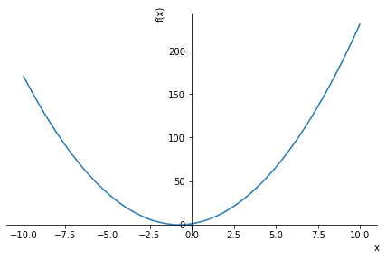

# sympy入门 
[hawksoft](http://github.com/xingyongkang)

[toc]


## 1 数值运算和符号运算

对于数学计算，计算机提供了两类支持库：
1. 程序语言提供的数学函数库。如C语言的math库，python的math包等。它们的特点主要是进行数值计算，如`sin()`函数，提供计算一个角度的正弦值。
2. 独立于程序设计语言的符号计算库，又称为计算机代数系统（computer algebra system）。


那么什么是符号计算呢？ 简单说， 就是以符号方式处理数学对象的运算。

下面的例子可以说明两者的区别：
给定一个关于$x$的多项式：$2x^{2}+3x+1$
当使$x = 2$，计算出这个多项式的值为$15$，这就是数值计算；
但如果我要计算这个多项式和其他多项式相乘的结果，如：
$$
(2x^2 + 3x + 1) \times x =2x^3+3x^2+x \\
(2x^2 + 3x + 1) \times (x+1)=2x^3+5x^2+4x+1
$$
这时就是符号计算了。即多项式中的$x$没有替换为具体的数字，而是作为符号(数学上我们习惯于称其为变量)参与运算。据此，你应该联想到，高中数学的多项式变换，高等数学的求解函数的不定积分，求解函数的导数，高等代数中的矩阵计算，等等，都是具有这种性质的运算，因此都是符号运算。


## 2 安装


需要系统已经安装了python环境。最好有IPython或者Jupyter Notebook环境，因为在后两者中，交互性更强，很好练手。


安装过程很简单，命令行输入如下命令：
> pip install sympy


就可以完成安装。

最常见的问题，就是安装很慢，且多次报错，一般都是网络问题，可以使用下面命令：
> pip install sympy -i https://pypi.tuna.tsinghua.edu.cn/simple


安装后，打开python，输入：
> import sympy 


如果没有报错，就说明安装正常。


## 3 基本使用

一般过程如下：
1. 定义变量符号
2. 定义表达式
3. 进行表达式计算
4. 表达式的变换


下面通过多项式运算演示：


```python
# 导入sympy包
import sympy as sym  

# 定义几个要用到符号（变量）
x,y,z = sym.symbols('x,y,z')

# 定义一个多项式
f1 =2 * x **2 + 3 * x + 1

#计算并打印当x=2时多项式的值
print(f1.subs(x,2))


#多项式相乘，获得一个新的多项式f2
f2 = f1 * (x+1)


#把多项式f1展开，并显示出来
print(sym.expand(f1))

#把多项式f1分解因子，并显示出来
print(sym.factor(f1))

#绘制多项式f1的函数图
sym.plot(f1)


#  解方程 2 * x **2 + 3 * x + 1 = 0 　
result = sym.solve(f1)
print(result)

```

    15
    2*x**2 + 3*x + 1
    (x + 1)*(2*x + 1)



    


    [-1, -1/2]


## 4 sympy与其他CAS


sympy是以python包的形式提供的CAS,具有以下优点：


1. 开源。按照(liberal BSD license),可以随便改动，随便卖钱。
2. 采用了python语法。要知道为了表示符号运算，一般的做法都是会定义一种新的语言，用来描述表达式。这意味着你需要学习一个编程语言之外的语言。
3. 轻量级。下载安装简单。


sympy支持的数学功能包括：
- 化简表达式
- 计算导数
- 积分
- 求极限
- 解方程
- 矩阵计算
- 组合数学
- 数论
- 命题逻辑
- ...


## 5 sympy的设计思想

开始入门，最好想着多项式运算，并明白两点：
1. 多项式是由多个符号构成的
2. 多项式的树状本质。可以递归定义。

在sympy设计中，定义了一个基本的类`Basic`,他是`Symbol`和`Func`类的父类。通过定义他的方法，完成了大多数的运算。相同的符号，遇到了不同的函数类，就形成了不同类型的表达式。通过增加不同的函数类，就可以简单地扩展功能，非常完美和优雅。

在设计中，巧妙地利用了表达式的递归定义，并采用语法蜜糖，具有以下的优点：
1. 扩展容易。只要增加新的运算符类，就能实现扩展。
2. 使用python的基本数据类型。

待续。。。
