***

# 2-1

**1.** 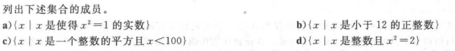

解： a) {1,-1}		b) {1,2,3,4,5,6,7,8,9,10,11}	 c) {0,1,4,9,16,25,36,49,64,81}	d) $\empty$ 

**3.**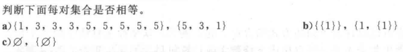

解：a) 相等		b)不相等		c) 不相等

**5.**

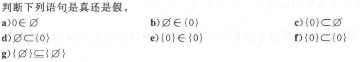

 解：用T表示真，F表示假

a) F	b)F		c)F		d)T		e)F		f)F		g) T

**7.**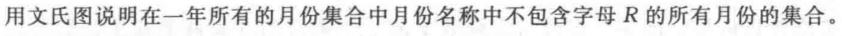

解：文氏图：

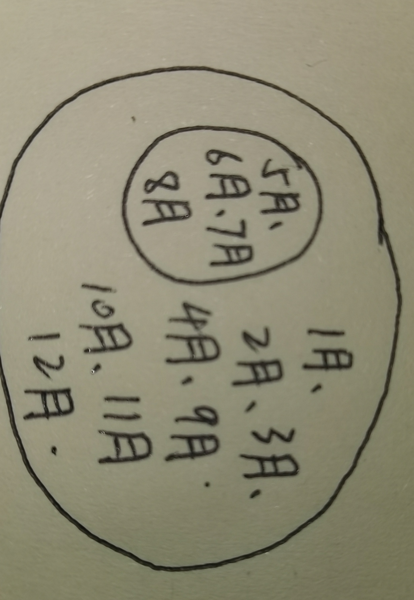

**10.**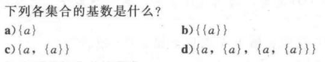

解：a) 1		b) 1		c) 2		d) 3

**11.**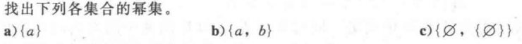

解：a) { {a}, $\empty$ }		b) { {a,b}, {a}, {b}, $\empty$ }		c) { { $\empty$ }, {{$\empty$}}, { $\empty$, { $\empty$ }}, $\empty$ }

**12.**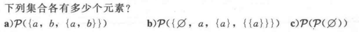

解：a) 8		b) 16		c) 2

**13.**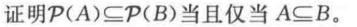

证明：$P$ (A) $\subseteq$ $P$ (B) 当且仅当 A$\subseteq$ B

>  先证   $P$(A) $\subseteq$ $P$ (B) $\rightarrow$ A $\subseteq$ B
>
>  $\forall$ x $\in$ A ,{x} $\in$ $P$ (A) ,而$P$ (A) $\subseteq$ $P$ (B) ,所以{x} $\in$ $P$ (B),
>
> 即 {x} $\subseteq$ B, 即 x $\in$ B,故 A $\subseteq$ B .
>
> 再证   A $\subseteq$ B $\rightarrow$ $P$(A) $\subseteq$ $P$ (B) 
>
> 对于A的任意一个子集C，有 C $\subseteq$ A $\subseteq$ B, 又 C $\in$ $P$(A) ，
>
> 所以 C $\in$ $P$ (B), 即 $P$ (A) $\subseteq$ $P$ (B) .
>
> 证毕！

**14.**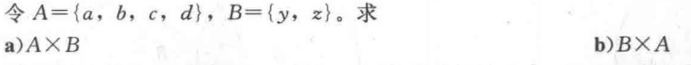

解：

a) { (a,y), (a,z), (b,y), (b,z), (c,y), (c,z), (d,y), (d,z) }

b) { (y,a), (y,b), (y,c), (y,d), (z,a), (z,b), (z,c), (z,d) }

**24.**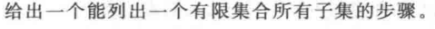

解：假设有限集为S={ a ~1~,a~2~,......a~n~ }. 由于S的子集有2^n^ 个，所以可以考虑用n位的二进制串来表达，

其中第i位为1当且仅当a~i~ $\in$ S, 所以只要按递增顺序写出所有的二进制串，就可以写出相应的子集。

***

# 2-2

**2.**

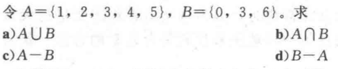

解：

a) A $\cup$ B = { 0,1,2,3,4,5,6}			b) A  $\cap$ B = { 3 }

c) A $-$ B = { 1,2,,4,5}					 d) B $-$ A = $\{$ 0,$6$ $\}$

**6.** 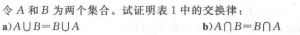

证明：

> a)  A $\cup$ B $\equiv$ { x| x$\in$ A $\vee$ x $\in$ B} $\equiv$ { x| x $\in$ B $\vee$ x $\in$ A} $\equiv$ B $\cup$ A

> b)  A $\cap$ B $\equiv$ { x| x $\in$ A $\wedge$ x $\in$ B} $\equiv$ {x| x$\in$ B $\wedge$ x $\in$ A} $\equiv$ B $\cap$ A 

**9.**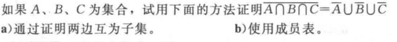

证明：

a) x$\in $  $\overline{A\cap B\cap C}$  $\equiv$ x $\notin$ A $\cap$ B $\cap$ C $\equiv$ $\neg$ (x $\in$ A $\wedge$ x $\in$ B $\wedge$ x $\in$ C) 

​				   			 	$\equiv$ x$\notin$ A $\vee$ x $\notin$ B $\vee$ x $\notin$ C $\equiv$ x$\in$ $\overline{A}$ $\vee$ x $\in$ $\overline{B}$ $\vee$ x $\in$ $\overline{C}$ 

​									 $\equiv$ x $\in$ $\overline{A}$ $\cup$ $\overline{B}$ $\cup$ $\overline{C}$  

b) 成员表证明：

|  A   |  B   |  C   | A $\cap$ B $\cap$ C | $\overline{A\cap B\cap C}$ | $\overline{A}$ | $\overline{B}$ | $\overline{C}$ | $\overline{A}$ $\cup$ $\overline{B}$ $\cup$ $\overline{C}$ |
| :--: | :--: | :--: | :-----------------: | :------------------------: | :------------: | :------------: | :------------: | :--------------------------------------------------------: |
|  1   |  1   |  1   |          1          |             0              |       0        |       0        |       0        |                             0                              |
|  1   |  1   |  0   |          0          |             1              |       0        |       0        |       1        |                             1                              |
|  1   |  0   |  1   |          0          |             1              |       0        |       1        |       0        |                             1                              |
|  1   |  0   |  0   |          0          |             1              |       0        |       1        |       1        |                             1                              |
|  0   |  1   |  1   |          0          |             1              |       1        |       0        |       0        |                             1                              |
|  0   |  1   |  0   |          0          |             1              |       1        |       0        |       1        |                             1                              |
|  0   |  0   |  1   |          0          |             1              |       1        |       1        |       0        |                             1                              |
|  0   |  0   |  0   |          0          |             1              |       1        |       1        |       1        |                             1                              |

**16.** 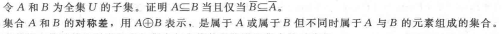

证明：

> A $\subseteq$ B $\equiv$ x $\in$ A $\rightarrow$ x $\in$ B
>
> $\equiv$ $\neg$ ( x $\in$ A) $\vee$ (x $\in$ B) 
>
> $\equiv$ x $\notin$ A $\vee$ $\neg$ ( x $\notin$ B) 
>
> $\equiv$ x $\in$ $\overline{A}$  $\vee$  $\neg$ ( x $\in$ $\overline{B}$ )
>
>  $\equiv$ $\neg$ ( x $\in$ $\overline{B}$ ) $\vee$   x $\in$ $\overline{A}$  
>
> $\equiv$ x $\in$ $\overline{B}$$ \rightarrow$  x $\in$ $\overline{A}$ 
>
> $\equiv$ $\overline{B}$ $\subseteq$ $\overline{A}$ 

**18.**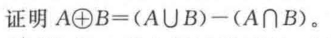

证明：x $\in$ (A $\cup$ B) $-$ (A $\cap$ B) 如果x属于A和B的并集但不属于A和B的交集；

而A $\oplus$ B 正是这样的定义。

**28.** 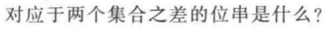

 如 果 第 一 个 位 串 的 第 i 位 是 1 而 第 二 个 位 串 的 第 i 位 为 0 ,则 两 个 集 合 之 差 的 位 串 的 第 i 位 是 1 ,否 则 为 0 .

下面我用成员表来演示对应于两个集合之差(A$-$ B)的位串：

|  A   |  B   | A$-$ B |
| :--: | :--: | :----: |
|  1   |  1   |   0    |
|  1   |  0   |   1    |
|  0   |  1   |   0    |
|  0   |  0   |   0    |

***

# 2-3

**1.**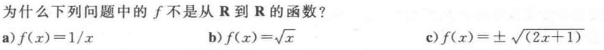

解：

a) x不能取到0

b) x不能取到负数

c) 对于每个x 都指派了两个不同的值，$f(x)$不是函数

**3.** 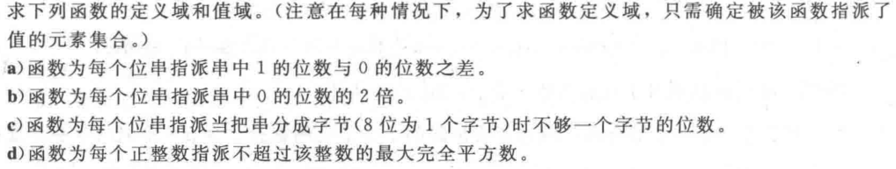

解：

a)定义域是所有位串集合，值域是整数集合

b) 定义域是所有位串集合，值域是非负偶整数集合

c) 定义域是所有位串集合，值域是{1,2,3,4,5,6,7}

d)定义域是正整数集合，值域是{1,4,9,16,25.......}

**8.** 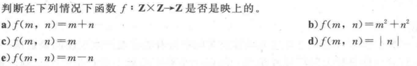

解：

a) 映上的	b)不映上的	c) 映上的	d) 不映上的	e) 映上的

**12.**  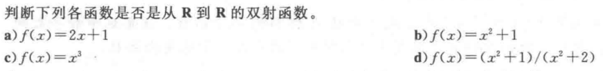

解：

a) 是	b)不是 	c) 是	d) 不是

**18.** 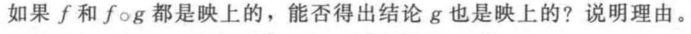

不是。

令 f : A{a,b} $\rightarrow$ B{c} 	g : C{d} $\rightarrow$ A{a,b};   f(a)=c,  f(b)=c,   g(d)=a

可见f , f$\circ$g 都是映上的，而g不是。

**39.** 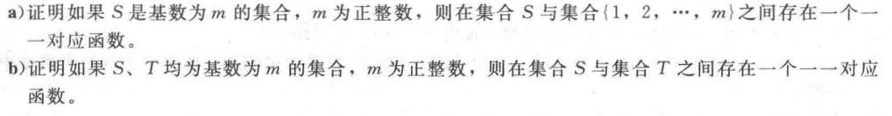

解：

a) S 的基数为m ， 说明S有m个不同的元素，所以可令

S的第x个元素对应整数x,这样就是一个一 一对应函数。

b) 由a知存在一个从S到{1,2,3，....}的双射函数f 和一个从{1,2,3，....}

到T的双射函数，合成g$\circ$f 就是S到T的双射函数。

***

# 2-4

**4.** 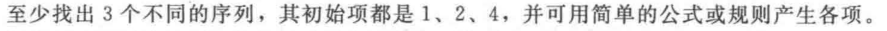

解：1，每一项是前一项的两倍；2，第n项等于前一项加上n-1; 

3，是正整数但不是3的倍数；

**6.** 

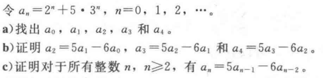

a) a~0~ = 6		a~1~ = 17		a~2~= 49		a~3~ = 143		a~4~ = 421

b) 5a~1~ - 6a~0~= 49=a~2~ 	5a~2~ - 6a~1~ = 143 = a~3~ 	5a~3~ -6a~2~ = 421 = a~4~

c) 证明：

> 依题意：
>
> a~n~=2^n^ + 5 $\cdot$ 3^n^  , a~n-1~ = 2^n-1^ + 5 $\cdot$ 3^n-1^  , a~n-2~ = 2^n-2^ + 5 $\cdot$ 3^n-2^ 
>
> $\therefore$  5a~n-1~  $-$ 6a~n-2~  = 5 $\cdot$ 2^n-1^ + 25 $\cdot$ 3^n-1^ $-$ 6 $\cdot$ 2^n-2^ $-$  30 $\cdot$ 3^n-2^ 
>
> ​									= 2 $\cdot$ 2^n-1^ + 15 $\cdot$ 3^n-1^ 
>
> ​									= 2^n^ + 5 $\cdot$ 3^n^
>
> ​									= a~n~ 
>
> 证毕！  

**9.**

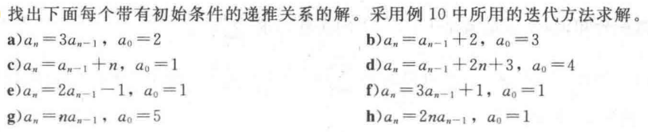

解：

a) a~n~ = 2 $\cdot$ 3^n^ 

b) a~n~ = 2n + 3

c) a~n~ = 1 + $\frac{n(n+1)}{2}$

d) a~n~ = n^2^ + 4n + 4 = (n+2)^2^

e) a~n~ = 1

f) a~n~ = $\frac{(3^{n+1} -1)}{2}$

g) a~n~ = 5n $!$ 

h) a~n~ = 2^n^n $!$

***

## Over!

