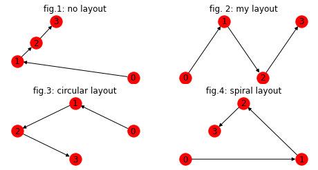
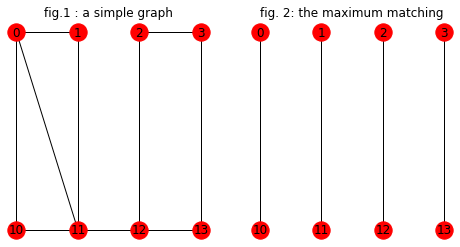

# 用networkx学习图论


networkx是一个操作图（graph）的python包。事实上它被称为复杂网络计算包，这也是她的名字networkx的来历。但网络是从实际应用来说的，初学者看到网络可能只会想到计算机网络，实际上这只是其中的的一种。以后大家会明白，大量的问题都可以表示为网络，如社交网络，分子结构等，而网络的数学基础就是图。


因此，作为图论初学者通过使用该包，不仅可以对抽象的知识能有具体的体验，更重要的是当前的图模型应用很广，越早介入，对将来的学习越有好处。

作为入门，可以按照下面的路线进行：


- 安装和使用
- 创建图
- 绘图
- 熟悉图的属性
- 使用图上的算法

## 0 安装

   最好使用最新的python版本，或者至少在3.5以上。
   执行下面命令安装networkx包：
   ```
   pip install networkx
   ```
   安装完成后，在模块的前面，按下述语句导入包就可以使用了：
   ```
   import networkx as nx
   import matplotlib.pyplot as plt 
   ```

   第2句导入的是pyplot，我们后面需要用该包来绘制图，所以一并导入。


## 1 创建图

   - 按照面向对象的思想,图本身就是一个对象，所以针对两种不同的图（无向图和有向图），networkx提供了两个class，分别是Graph和DiGraph。
   - 图由点和边构成，所以Graph对象提供了两个方法，一个用于向图中添加节点，一个用于向图中添加边。为了一次添加多个节点（边），这些方法的参数是列表.
   - 图中可以删除节点，删除边。这些都有对应的方法。

  看下面的代码：


```python
import networkx as nx
g = nx.Graph()
g.add_nodes_from([0,1,2,3])
g.add_edges_from([(0,1),(1,2),(2,3)])
```

如果是有向图，只需改变第一句，其它操作完全相同。

看下面的代码：


```python
import networkx as nx
g = nx.DiGraph()
g.add_nodes_from([0,1,2,3])
g.add_edges_from([(0,1),(1,2),(2,3)])
```

## 2 绘图

借助于pyplot，networkx可以很方便地把定义的graph绘制出来，感觉更直观，尤其对于初学者。


networkx提供了一个绘图的函数draw,该函数参数很多，但最关键是第二个，确定每个节点的坐标。当节点的坐标定了，边也就定了，图形当然就定了。这个称为布局（layout），它实际是一个字典对象，每一个key对应一个节点，其value是该节点在绘图时的坐标（x，y）。注意在pyplot坐标系统中，（0，0）位于左下角，x坐标向右增长，y坐标向上增长。


另外，networkx也提供了一些布局。这些布局是以函数的形式提供的，只要把图对象带入该函数，该函数的返回布局字典。

看下面代码：


```python
fig=plt.figure(figsize=(8,4))    # 设置绘图区域的大小

ax1=fig.add_subplot(2,2,1)       #将绘图区域分为2行2列，共4个区域，这里在第1个区域绘图
ax1.set_title('fig.1: no layout')
nx.draw(g, with_labels=True, node_color='red') 

ax2=fig.add_subplot(2,2,2)       #将绘图区域分为2行2列，共4个区域，这里在第2个区域绘图
ax2.set_title('fig. 2: my layout')
pos = {0:(0,0),1:(1,5),2:(2,0),3:(3,5)}
nx.draw(g, pos,with_labels=True, node_color='red')

ax3=fig.add_subplot(2,2,3)        #将绘图区域分为2行2列，共4个区域，这里在第3个区域绘图
ax3.set_title('fig.3: circular layout')
pos = nx.layout.circular_layout(g)
nx.draw(g,pos ,with_labels=True, node_color='red')

ax4=fig.add_subplot(2,2,4)        #将绘图区域分为2行2列，共4个区域，这里在第4个区域绘图
ax4.set_title('fig.4: spiral layout')
pos = nx.layout.planar_layout(g)
nx.draw(g,pos ,with_labels=True, node_color='red')
plt.show()
```



    


解释如下：
- 对同一个图对象，我绘制了四个图，布局各不相同
- fig1 没有布局参数，所以networkx使用默认布局
- fig2 提供了自己的布局
- fig3和fig4使用了networkx提供的布局函数。

draw函数还有其它参数，可以自己慢慢去体会。

## 3 图的属性


在一个图中，如节点数目，边的数目，节点的度，这些称为图的属性。

按照面向对象的思路，这些通过Graph对象的属性和方法来获得。

看代码：


```python
print(g.nodes)  #列出图中节点，结构为列表
print(g.nodes())
print(g.edges)  # 边的列表
print(g.degree) # 节点度的列表
print(nx.degree_histogram(g))  # 节点度的值的分布，叫做直方图
print(g.number_of_nodes())
print(g.number_of_edges())
```

    [0, 1, 2, 3]
    [0, 1, 2, 3]
    [(0, 1), (1, 2), (2, 3)]
    [(0, 1), (1, 2), (2, 2), (3, 1)]
    [0, 2, 2]
    4
    3


看每一个属性的名字，应该很好猜。

说句题外话，networkx真的很贴心。看上面代码的1和2行，都是列出图中的节点，但1用的对象属性nodes，而2用的是对象的方法nodes( )。不知你们有没有这样的困惑，在使用对象时，我们经常不知道某一个名字是属性还是方法，也就是说不知道后面要不要写括号。对此，在nerworkx中，每一个属性都有同名方法，所以就避免了这个困惑，是不是很体贴，最起码比sympy好得多。

下面代码验证握手定理： (所有边的度数之和等于边的数目的2倍)


```python
sum_deg = 0
for i in g.degree:
    sum_deg = sum_deg + i[1]
print(sum_deg == g.number_of_edges() * 2)
```

    True


## 4  图上的算法


入门之后，你的回报就来了，最大的回报就是我们学习过或将要学习的大量与图相关的算法，这里都以函数或方法的形式提供给你了。


下面代码，以我们课堂上提到的最大匹配问题举例，主要功能是：

- 创建图g
- 求g的最大匹配match
- 绘出g和match的图


```python
import networkx as nx
import matplotlib.pyplot as plt

# 创建图g
g  = nx.Graph()
g.add_nodes_from([0,1,2,3,10,11,12,13])
g.add_edges_from([(0,10),(0,11),(1,11),(2,12),(3,13),(0,1),(13,10),(2,3)])

#求最大匹配
match = nx.max_weight_matching(g)    
g_match = nx.Graph()
for kk,vv in match:
    g_match.add_edge(kk,vv)

# 创建布局，注意两个图都使用这个布局，便于对比
pos = {0: (0, 5), 1: (1, 5), 2: (2, 5), 3: (3, 5), 10: (0, 0), 11: (1, 0), 12: (2, 0), 13: (3, 0)}

# 绘图
fig=plt.figure(figsize=(8,4))

ax1=fig.add_subplot(1,2,1)
nx.draw(g, pos, with_labels=True, node_color='red')
ax1.set_title('fig.1 : a simple graph')

ax2=fig.add_subplot(1,2,2)
nx.draw(g_match,pos,  with_labels=True, node_color='red')
ax2.set_title('fig. 2: the maximum matching')

plt.show() 
```


​    

​    


为了保证上面代码的可读性，第16行直接给出了布局字典，它其实是下面布局函数的调用结果。


```python
def myLayout(g):
    pos = []
    for i in g.nodes:
        if i>=10:
            pos.append((i-10,0))
        else:
            pos.append((i,5))
    pos = dict(zip(g.nodes,pos))
    print(pos)
    
myLayout(g)
```

    {0: (0, 5), 1: (1, 5), 2: (2, 5), 3: (3, 5), 10: (0, 0), 11: (1, 0), 12: (2, 0), 13: (3, 0)}

